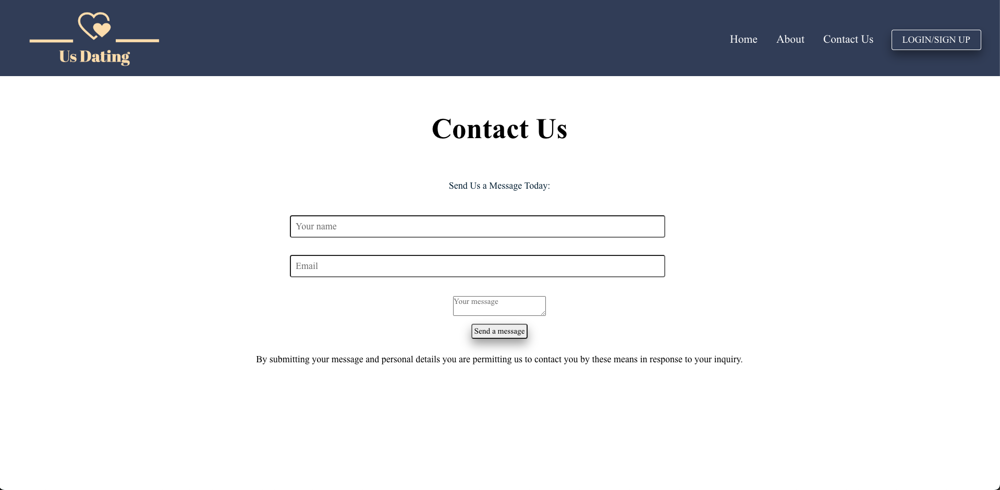
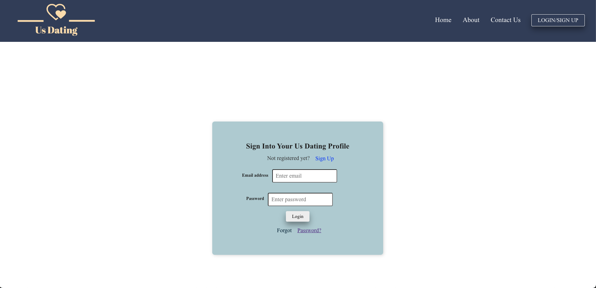
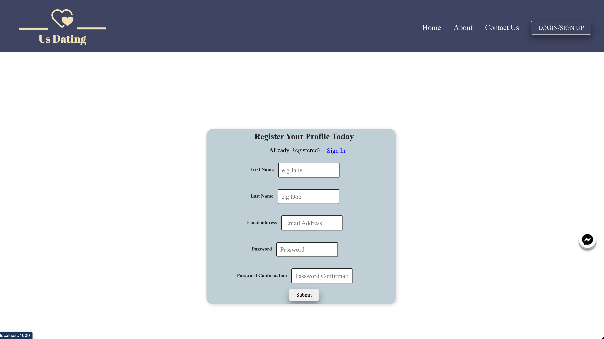
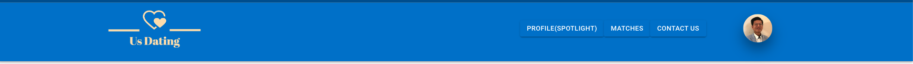

## Welcome to  Us Dating App Project!

This is a full-stack project using React to build frontend and Ruby on Rails to build backend.

The backend code is in the root directory of this project, and the frontend code is in the client directory.

Fork and clone this repo, cd into the directory and run:

```console
bundle install
```
to install all the backend dependencies, then run:

```console
rails db:create db:migrate
rails s
```


to setup the database and start the server.
Next, open another terminal window and run:
```console
npm install --prefix client
npm start --prefix client
```

to install all the frontend dependencies and start the application.

## Backend Technologies
- Ruby Rails
- Postgresql

## Frontend Technologies
- React.Js
- Postgresql
- Material UI


## Project Preview(Main Home Landing Page)
Here is the Previews of  the Main Home Landing Page 


## Project Preview(About Page)
Previews of About Page


## Project Preview(Contact Page)
Preview of Contact Page



## Project Preview(Login and Sign-up Form Page)
Previews of Login and Sign-up Form Page



## Project Preview(Main Logged in with User Page)
Previews of Main logged In with User Page and the user icon changes depending on different users that are signed in and show all of their matches besides themselves. 


 Here is a different user being logged in and their respective profile icon
 

## Project Preview(Profile/Picks Page)
Previews of the profile Picks Page 


## Project Preview(Matches Preview)
Preview of the Matches Component that shows their specific matches when you log into their respective user profile


## Project Preview(Avatar Preview)
Previews of the Avatar Icon that shows the user's name when you hover over the icon and the logout button within the avatar when you click on it.


